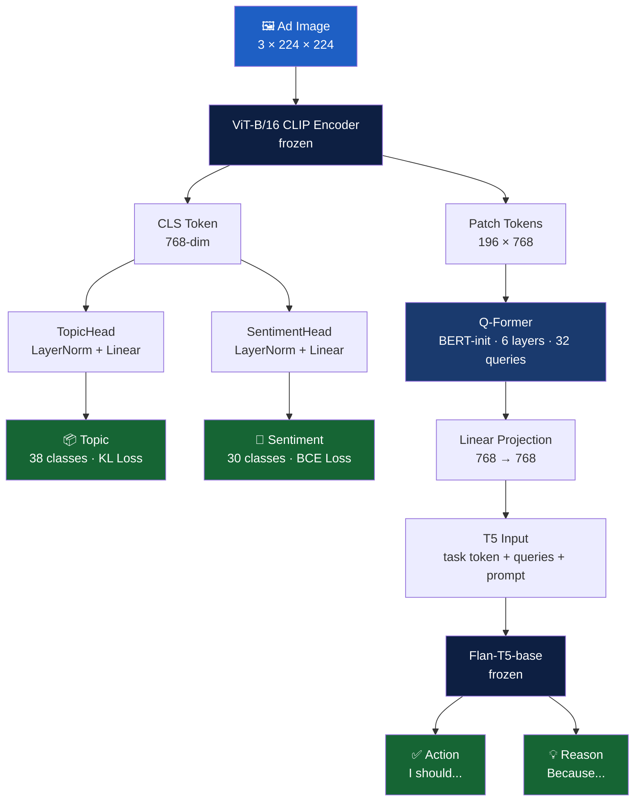

# AdVox — The Voice of Ads

AdVox is a multi-task vision-language model for advertisement understanding.
It analyzes advertisement images across four tasks — topic, sentiment, action, and reason.

> 💡 This is the **research version (V4)** of AdVox.
> For the deployment version, see the links below.

🚀 **Live Demo:** [Click here](https://vins-tech-advox.hf.space)

☁️ **Deployment Version:** [Click here](https://huggingface.co/spaces/Vins-Tech/Advox/tree/main)

---

## ⚡ What AdVox Does

Given an advertisement image, AdVox:

1. 🏷️ Predicts the **topic** of the advertisement (38 categories)
2. 💬 Predicts the **sentiments** evoked by the ad (30 emotions, multi-label)
3. ✅ Generates an **action** — "I should..." describing the intended consumer response
4. 💡 Generates a **reason** — "Because..." explaining why the consumer should act

---

## 🏗️ Architecture



---

## 🧩 Model Components

| Component | Details | Parameters |
|---|---|---|
| ViT-B/16 CLIP | `vit_base_patch16_clip_224` via timm — frozen | ~86M |
| Topic Head | LayerNorm + Linear(768→38) + log-softmax | ~30K |
| Sentiment Head | LayerNorm + Linear(768→30) raw logits | ~23K |
| Q-Former | BERT-base init, 6 layers, 12 heads, 32 query tokens | ~32M |
| Linear Projection | Linear(768→768) | ~590K |
| Task Tokens | 2 learned vectors — action / reason | 1.5K |
| Flan-T5-base | `google/flan-t5-base` — always frozen | ~250M |
| **Total** | | **~391M** |
| **Trainable** | | **~58M** |

---

## 📉 Loss Functions

| Task | Loss | Weight |
|---|---|---|
| Topic | KL Divergence (soft labels) | 0.30 |
| Sentiment | Masked Binary Cross-Entropy | 0.25 |
| Action | T5 Cross-Entropy (seq2seq) | 0.25 |
| Reason | T5 Cross-Entropy (seq2seq) | 0.20 |

> Sentiment loss is masked for subfolders sf4–sf9 which have no sentiment annotations.
> Action/Reason loss is masked for sf10 which has no QA annotations.

---

## 📊 Results

Trained on the Ads Dataset (sf0–sf9, ~56k images) for 12 epochs.

| Metric | Score |
|---|---|
| Topic Accuracy | 64.29% |
| Sentiment MAE | 0.0593 |
| BLEU-4 Action | 0.2511 |
| BLEU-4 Reason | 0.0779 |

---

## 🛠️ Tech Stack

| Component | Technology |
|---|---|
| Vision Encoder | ViT-B/16 CLIP via timm |
| Visual-Language Bridge | Q-Former (BERT-base initialized) |
| Text Decoder | Flan-T5-base (HuggingFace Transformers) |
| Training | PyTorch + AMP (mixed precision) |
| Evaluation | NLTK BLEU-4, L1 MAE |
| Config | YAML |

---

## 📂 Project Structure

```
Advox/
├── src/
│   ├── model.py        ← AdVox model — ViT + Q-Former + Flan-T5
│   ├── dataset.py      ← PyTorch dataset — annotator-expanded samples
│   ├── train.py        ← Training loop — AMP, masked loss, checkpointing
│   ├── evaluate.py     ← Evaluation — Topic accuracy, Sentiment MAE, BLEU-4
│   └── utils.py        ← Config loader, label maps, soft label helpers, transforms
├── configs/
│   └── config.yaml     ← All hyperparameters
├── requirements.txt
└── README.md
```

---

## 🔑 Setup

### 1. Clone the repo

```bash
git clone https://github.com/Vins-Tech/Advox.git
cd Advox
```

### 2. Install dependencies

```bash
pip install -r requirements.txt
```

### 3. Download the dataset

Download subfolders 0–9 from the Ads Dataset and place them as:

```
data/raw/0/        ← subfolder-0 images
data/raw/1/        ← subfolder-1 images
...
data/raw/9/        ← subfolder-9 images
data/annotations/  ← all JSON annotation files
```

### 4. Train

```bash
python src/train.py
```

### 5. Evaluate

```bash
python src/evaluate.py
```

### 6. Inference

```bash
python src/inference.py --image path/to/ad.jpg
```

---

## ⚙️ Configuration

All hyperparameters are in `configs/config.yaml`. Key settings:

```yaml
training:
  epochs:        12
  batch_size:    16
  learning_rate: 0.0001
  warmup_epochs: 2

freezing:
  freeze_encoder_epochs: 999   # ViT always frozen
  freeze_t5: true              # Flan-T5 always frozen

loss_weights:
  topic:     0.30
  sentiment: 0.25
  action:    0.25
  reason:    0.20
```

---

## 📦 Dataset

This project uses the **Ads Dataset** from CVPR 2017.

- 64,832 advertisement images across 11 subfolders
- Annotations: Topics, Sentiments, QA Action, QA Reason, Strategies, Slogans

**Citation:**

```
Automatic Understanding of Image and Video Advertisements.
Zaeem Hussain, Mingda Zhang, Xiaozhong Zhang, Keren Ye, Christopher Thomas,
Zuha Agha, Nathan Ong, Adriana Kovashka.
Proceedings of the IEEE Conference on Computer Vision and Pattern Recognition (CVPR), 2017.
```

---

## ⚠️ License Notice

This project is licensed under the **Apache License 2.0**. See [LICENSE](LICENSE) for details.

This project uses third-party models and datasets:
- **Ads Dataset (CVPR 2017)** — subject to original authors' terms and citation requirements
- **CLIP** — subject to OpenAI's license
- **Flan-T5** — subject to Apache 2.0 (Google)
- **BERT** — subject to Apache 2.0 (Google)

This repository's license applies only to the original code in this repo.

---

## 🔗 Related

- ☁️ **Deployment Version:** [https://huggingface.co/spaces/Vins-Tech/Advox/tree/main](https://huggingface.co/spaces/Vins-Tech/Advox/tree/main)
- 🚀 **Live Demo:** [https://vins-tech-advox.hf.space](https://vins-tech-advox.hf.space)

---

👨‍💻 **Built by Vinay S**
📧 vins.techn@gmail.com
